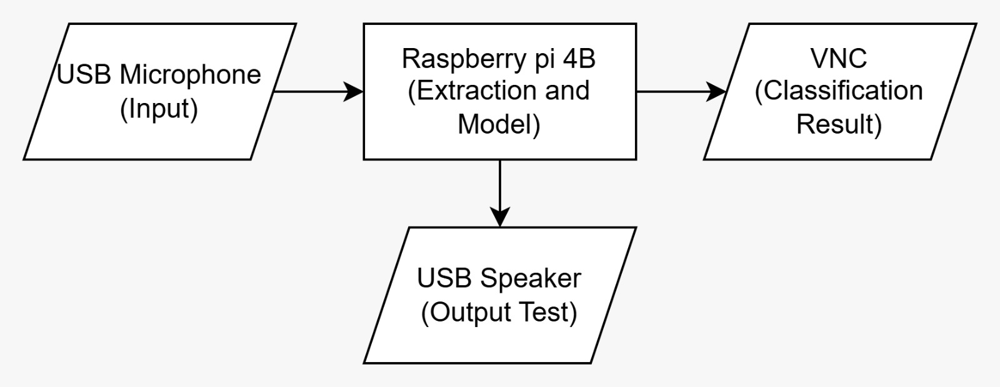
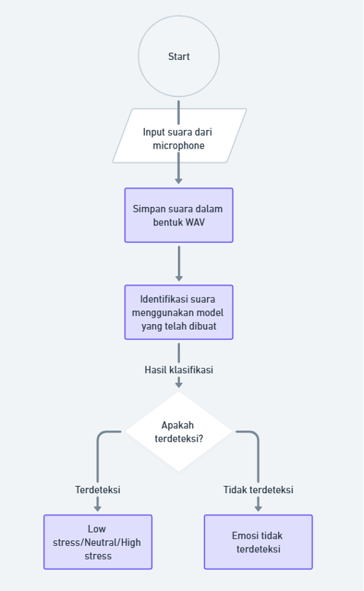
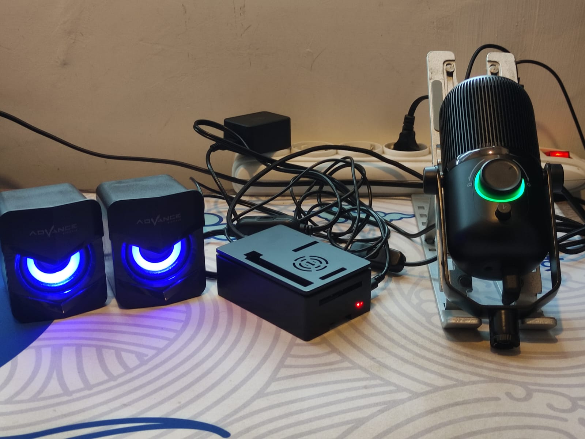

# Sistem Deteksi Stress Dengan Suara Berbasis Raspberry Pi

Deteksi stress dengan suara menggunakan model ANN dan platform Raspberry Pi 4B

## Anggota Kelompok

1. Abdullah Fathan - 215150300111023
2. Sajdah Kholifatul Nisa - 215150301111010
3. Ahmad Dzikri Fathulramdhan - 215150307111004
4. Rafif Ramadhani Azmi - 215150300111020
5. Muhammad Daffa Ramadhani - 215150300111035

## Komponenen

1. Raspberry Pi 4B
2. Speaker
3. Usb Microphone

## Dataset

[Dataset Suara (menggunakan email ub)](https://drive.google.com/drive/folders/1V3beCq4iFl9vQK5OblUxeONiCVzAuFiw?usp=sharing)

## Arsitektur Sistem

## Flowchart

## Dokumentasi

1. Foto

2. Video Demo

[Tekan Saya](https://drive.google.com/file/d/1_CYfVi0nEDSSncCDu5UBidSD9NjiWFgG/view)
